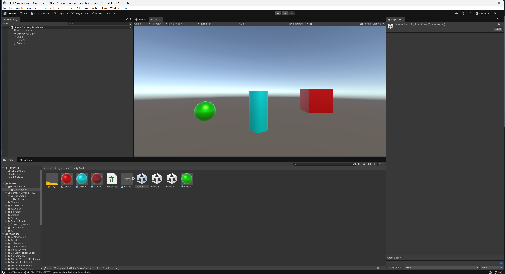
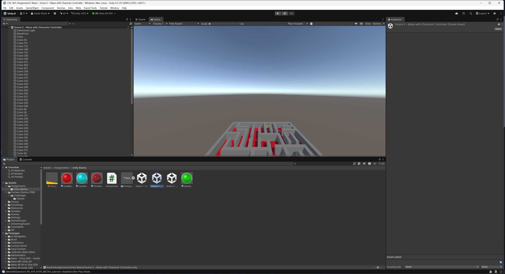
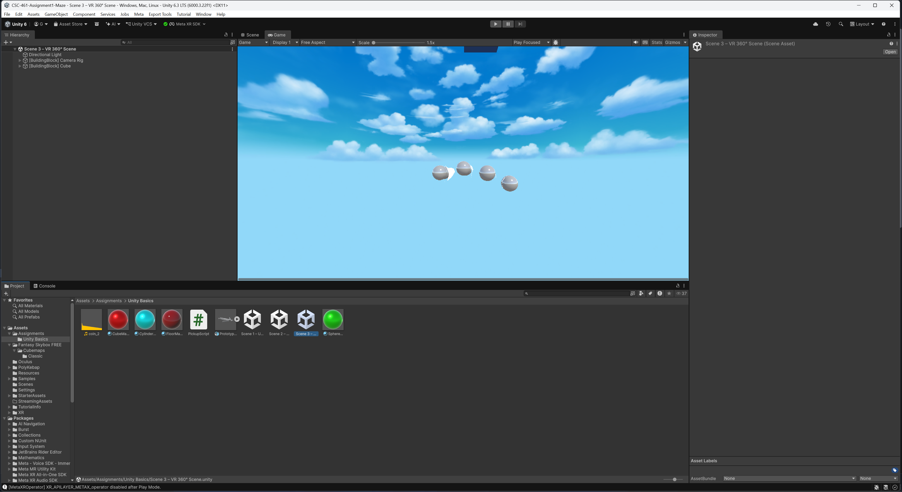

# Carter Petersen
# CSC 461/592 – Assignment 1: Unity Basics

## Scene 1 – Unity Primitives
This is a scene with 3 shapes and 3 different custom materials.

## Scene 2 – Maze
This is a VR scene with a character controller that you can control through a maze. Picking up the coin at the end of the maze makes a sound.

*Note: the camera is not facing down, since tilting it down becomes extremely disorienting in VR.*

## Scene 3 – VR 360
A VR scene that displays a custom skybox, along with a cube you can interact with.
